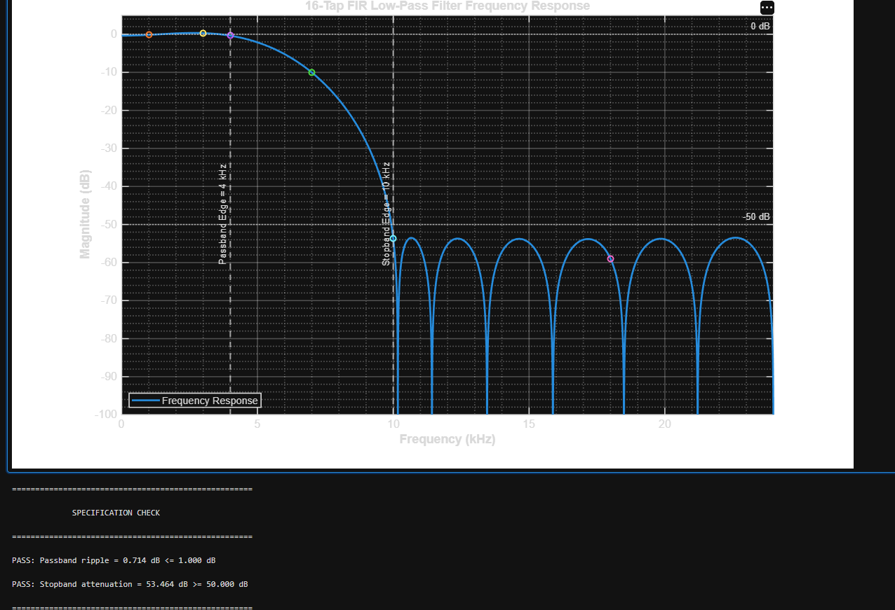
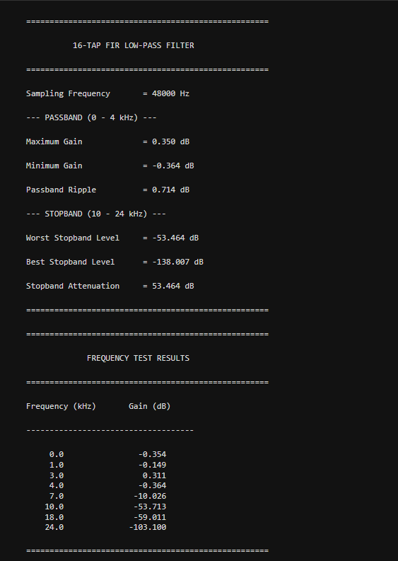
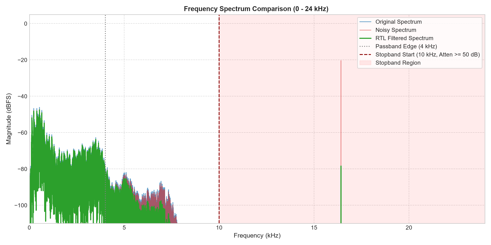
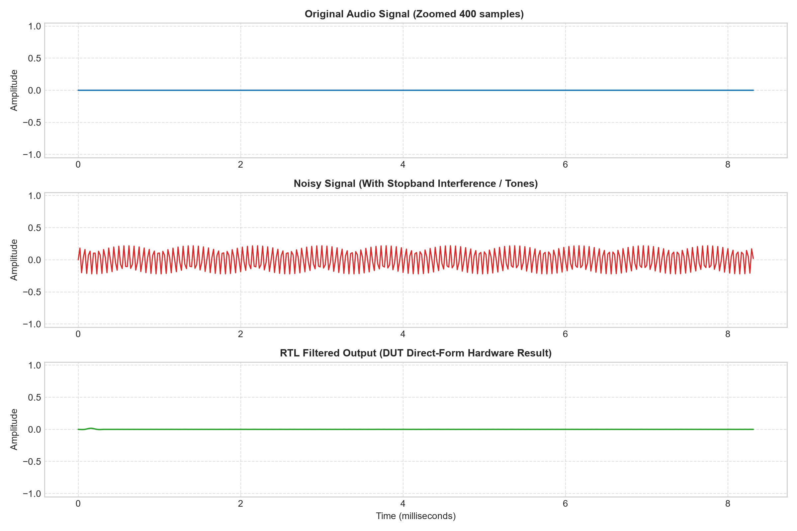

# 🎧 16-Tap Direct-Form FIR Low-Pass Filter

[](rtl/)
[](sim/)
[](matlab/)
[](Audio_Test_Tool/)
[](#4-fixed-point-arithmetic--wordlength-growth)
[](#8-hardware-audio-verification-platform)

An end-to-end **Digital Signal Processing (DSP) Hardware Mini-Project** implementing a **16-Tap Direct-Form Finite Impulse Response (FIR) Low-Pass Filter** in **Verilog HDL**. 

The repository features complete filter synthesis in **MATLAB**, bit-exact fixed-point quantization (**Q1.15**), automated simulation in **ModelSim / QuestaSim**, and an end-to-end **Hardware-in-the-Loop Audio Verification Platform** with both interactive GUI and CLI runners that stream real audio through the RTL DUT.

---

## 📑 Table of Contents

- [1. Filter Specifications](#1-filter-specifications)
- [2. System Architecture](#2-system-architecture)
- [3. Repository Structure](#3-repository-structure)
- [4. Fixed-Point Arithmetic & Wordlength Growth](#4-fixed-point-arithmetic--wordlength-growth)
- [5. Filter Coefficients](#5-filter-coefficients)
- [6. MATLAB Design & Frequency Analysis](#6-matlab-design--frequency-analysis)
- [7. RTL Implementation & ModelSim Simulation](#7-rtl-implementation--modelsim-simulation)
- [8. Hardware Audio Verification Platform](#8-hardware-audio-verification-platform)
  - [8.1 System Overview](#81-system-overview)
  - [8.2 Spectral & Time-Domain Analysis](#82-spectral--time-domain-analysis)
  - [8.3 Quantitative Verification Report](#83-quantitative-verification-report)
- [9. How to Run](#9-how-to-run)
  - [9.1 Prerequisites](#91-prerequisites)
  - [9.2 RTL Simulation (ModelSim)](#92-rtl-simulation-modelsim)
  - [9.3 Audio Verification GUI](#93-audio-verification-gui)
  - [9.4 MATLAB Synthesis](#94-matlab-synthesis)
- [10. Authors & License](#10-authors--license)

---

## 1. Filter Specifications

| Parameter | Specification Target | Achieved Performance | Status |
| :--- | :--- | :--- | :---: |
| **Sampling Frequency ($F_s$)** | $48\text{ kHz}$ | $48\text{ kHz}$ | Verified |
| **Passband Edge ($F_p$)** | $0 - 4\text{ kHz}$ | $0 - 4\text{ kHz}$ | Verified |
| **Passband Ripple ($\delta_p$)** | $\le 1.0\text{ dB}$ | **$0.714\text{ dB}$** | **PASS** |
| **Stopband Edge ($F_{stop}$)** | $\ge 10\text{ kHz}$ | $10 - 24\text{ kHz}$ | Verified |
| **Stopband Attenuation ($A_s$)** | $\ge 50.0\text{ dB}$ | **$53.464\text{ dB}$** | **PASS** |
| **Filter Order ($N-1$)** | $15$ | $15$ | Verified |
| **Number of Taps ($N$)** | $16$ | $16$ | Verified |
| **Filter Type** | Linear-Phase Low-Pass (FIR) | Type I Symmetric FIR | Verified |
| **Architecture** | Direct-Form FIR | Direct-Form (16 Multipliers + Adder Tree) | Verified |

---

## 2. System Architecture

The hardware datapath is designed as a fully parallel **Direct-Form FIR Filter**:
- **15-Stage Shift Register (Delay Line)**: Buffers consecutive input samples $x[n-1]$ to $x[n-15]$.
- **16 Signed Multipliers**: Multiplies current and delayed samples with 16-bit quantized coefficients $h[k]$.
- **16-Product Adder Tree**: Sums the 32-bit products with four guard bits to prevent overflow.
- **Registered Output Accumulator**: Truncates the 36-bit accumulator to signed 16-bit Q1.15 format on the system clock edge.

```text
                             x_in [15:0] (Q1.15)
                                     │
                     ┌───────────────┴───────────────┐
                     │      15-stage delay line      │
                     │    (x_d0, x_d1, ... x_d14)    │
                     └───────────────┬───────────────┘
                                     │
       ┌──────────────┬──────────────┼──────────────┬──────────────┐
       ▼              ▼              ▼              ▼              ▼
    x[n]·h0       x[n-1]·h1      x[n-2]·h2         ...        x[n-15]·h15
    (Q2.30)        (Q2.30)        (Q2.30)                       (Q2.30)
       │              │              │                             │
       └──────────────┴──────────────┼─────────────────────────────┘
                                     ▼
                           16-Product Adder Tree
                                     │
                           36-Bit Sum (Q6.30)
                                     │
                          Registered Output Truncation
                                 acc[30:15]
                                     │
                            y_out [15:0] (Q1.15)
```

### Latency & Pipeline Timing
The output register is updated synchronously on the clock edge (`posedge clk`). The output for sample $n$ reflects the current sample and previous states with **zero additional algorithmic latency** beyond the FIR's intrinsic group delay ($N/2 = 8\text{ samples}$).

---

## 3. Repository Structure

```text
FIR_Project/
├── rtl/                               # Verilog HDL Synthesizable Source Files
│   ├── fir_filter.v                  # Top-level FIR Filter Module
│   ├── fir_datapath.v                # 15 Delay Registers + 16 Multipliers
│   └── fir_accumulator.v             # 36-bit Adder Tree & Output Register
├── tb/                                # Verification Testbenches
│   ├── fir_filter_tb.v               # 3072-Sample Unit Testbench (Cases 1, 2, 3)
│   └── fir_audio_tb.v                # Streaming Hardware Audio Testbench
├── Audio_Test_Tool/                   # Hardware-in-the-Loop Python Platform
│   ├── src/
│   │   ├── gui_app.py                # Full-featured Modern Tkinter/Custom GUI
│   │   ├── main.py                   # Automated Headless CLI Controller
│   │   ├── analysis.py               # FFT Spectrum & Time-Domain Plotter
│   │   ├── golden_model.py           # Bit-Exact Python Simulator (acc[30:15])
│   │   ├── q15.py                    # Fixed-Point Q1.15 / Two's Complement Math
│   │   ├── audio_io.py               # 48 kHz WAV Audio Loader & Player
│   │   ├── noise_gen.py              # Stopband Interference & AWGN Engine
│   │   ├── rtl_io.py                 # Hex Stimulus / Response Exporter
│   │   └── sim_runner.py             # ModelSim Batch Simulation Driver
│   └── results/                      # Generated Audio Plots & Verification Logs
├── matlab/                            # Filter Design & Validation Scripts
│   ├── design_filter.m               # Equiripple FIR Filter Design Script
│   ├── quantize_coeffs.m             # Q1.15 Quantizer & coeffs.hex Generator
│   ├── generate_vectors.m            # Test Stimulus & Golden Vector Generator
│   ├── golden_model.m                # Bit-Exact Golden Reference Model
│   └── verify_rtl_output.m           # RTL vs Golden Comparator
├── data/                              # Test Vectors & Coefficients (Hex)
│   ├── coeffs.hex                    # 16 Quantized Coefficients in Hex
│   ├── case1_1k_18k.hex              # Stimulus: 1 kHz + 18 kHz Tone
│   ├── golden1_1k_18k.hex            # Golden Reference for Case 1
│   ├── case2_1k_7k.hex               # Stimulus: 1 kHz + 7 kHz Tone
│   ├── golden2_1k_7k.hex             # Golden Reference for Case 2
│   ├── case3_1k_3k.hex               # Stimulus: 1 kHz + 3 kHz Tone
│   └── golden3_1k_3k.hex             # Golden Reference for Case 3
├── sim/                               # Simulation Scripts & Work Library
│   ├── run.do                        # ModelSim Batch TCL Script (Unit TB)
│   └── run_audio.do                  # ModelSim Batch TCL Script (Audio TB)
├── docs/                              # Documentation & Visual Assets
│   ├── images/                       # High-Resolution Verification Plots
│   ├── AUDIO_VERIFICATION.md         # Detailed Audio Verification Architecture
│   └── zdc_fir_miniproject.pdf       # Project Specifications Document
├── run.bat                            # 1-Click ModelSim Unit Test Launcher
├── run_gui.bat                        # 1-Click Audio Verification GUI Launcher
├── run_audio.bat                      # 1-Click CLI Audio Verification Launcher
├── requirements.txt                   # Python Dependencies
└── README.md                          # Project Documentation
```

---

## 4. Fixed-Point Arithmetic & Wordlength Growth

To avoid precision loss and arithmetic overflow, the design adheres strictly to signed two's complement fixed-point arithmetic:

1. **Input & Coefficient Format ($\text{Q}1.15$)**:
   - $1\text{ sign bit} + 15\text{ fractional bits}$.
   - Numerical range: $[-1.0, +1.0 - 2^{-15}] \approx [-1.0, +0.999969]$.
   - Conversion formula:
     $$\text{Integer Value} = \text{round}(x \times 2^{15})$$

2. **Multiplier Wordlength ($\text{Q}2.30$)**:
   - Signed $16\text{-bit} \times 16\text{-bit}$ multiplication yields a **signed 32-bit product** in $\text{Q}2.30$ format.

3. **Accumulator Wordlength ($\text{Q}6.30$)**:
   - Summing $16$ products requires $\lceil \log_2(16) \rceil = 4$ guard bits to prevent overflow under maximum dynamic range:
     $$32\text{ bits} + 4\text{ guard bits} = 36\text{ bits } (\text{Q}6.30)$$

4. **Output Extraction ($\text{Q}1.15$)**:
   - Truncated from bits `[30:15]` of the 36-bit accumulator:
     ```verilog
     y_out <= acc[30:15];
     ```

---

## 5. Filter Coefficients

The 16 symmetric impulse response coefficients are quantized into signed 16-bit integers and represented in hexadecimal:

| Tap ($k$) | Normalized Real Value | Quantized Integer ($\text{Q}1.15$) | Hexadecimal (`coeffs.hex`) |
| :---: | :---: | :---: | :---: |
| **0** | $-0.007385$ | $-242$ | `FF0E` |
| **1** | $-0.021088$ | $-691$ | `FD4D` |
| **2** | $-0.033417$ | $-1095$ | `FBB9` |
| **3** | $-0.025696$ | $-842$ | `FCB6` |
| **4** | $+0.019257$ | $+631$ | `0277` |
| **5** | $+0.100922$ | $+3307$ | `0CEB` |
| **6** | $+0.192993$ | $+6324$ | `18B4` |
| **7** | $+0.254456$ | $+8338$ | `2092` |
| **8** | $+0.254456$ | $+8338$ | `2092` |
| **9** | $+0.192993$ | $+6324$ | `18B4` |
| **10** | $+0.100922$ | $+3307$ | `0CEB` |
| **11** | $+0.019257$ | $+631$ | `0277` |
| **12** | $-0.025696$ | $-842$ | `FCB6` |
| **13** | $-0.033417$ | $-1095$ | `FBB9` |
| **14** | $-0.021088$ | $-691$ | `FD4D` |
| **15** | $-0.007385$ | $-242$ | `FF0E` |

*Note: The symmetry ($h[k] = h[15-k]$) guarantees exact linear phase and constant group delay.*

---

## 6. MATLAB Design & Frequency Analysis

The filter design was modeled and analyzed using MATLAB's DSP toolbox. The frequency response confirms that both passband ripple and stopband attenuation exceed project specifications.

### Frequency Response Curve


### Performance & Specification Check


### Key Frequency Attenuation Points

| Frequency | Target Role | Measured Gain (dB) | Verdict |
| :---: | :---: | :---: | :---: |
| **$0\text{ Hz}$ (DC)** | Passband Center | $-0.354\text{ dB}$ | PASS |
| **$1\text{ kHz}$** | In-Band Audio | $-0.149\text{ dB}$ | PASS |
| **$3\text{ kHz}$** | Passband High | $+0.311\text{ dB}$ | PASS |
| **$4\text{ kHz}$** | Passband Edge ($F_p$) | $-0.364\text{ dB}$ | PASS ($\text{Ripple} \le 0.714\text{ dB}$) |
| **$7\text{ kHz}$** | Transition Band | $-10.026\text{ dB}$ | Intermediate Attenuation |
| **$10\text{ kHz}$** | Stopband Edge ($F_{stop}$) | **$-53.713\text{ dB}$** | **PASS ($\ge 50\text{ dB}$)** |
| **$18\text{ kHz}$** | Stopband Deep Notch | **$-59.011\text{ dB}$** | **PASS ($\ge 50\text{ dB}$)** |
| **$24\text{ kHz}$ (Nyquist)** | Frequency Limit | **$-103.100\text{ dB}$** | **PASS ($\ge 50\text{ dB}$)** |

---

## 7. RTL Implementation & ModelSim Simulation

The filter is partitioned into modular synthesizable Verilog modules:
1. `fir_datapath.v`: Implements the shift registers and signed 16-bit multiplications.
2. `fir_accumulator.v`: Implements the signed adder tree, 36-bit accumulator, and `acc[30:15]` extraction.
3. `fir_filter.v`: Top-level structural wrapper connecting datapath and accumulator.

### Testbench Verification Cases

The testbench (`tb/fir_filter_tb.v`) executes three verification cases (1024 samples each, totaling 3072 samples) and compares every output against bit-exact golden vectors:

- **Case 1 ($1\text{ kHz} + 18\text{ kHz}$)**: Passband tone ($1\text{ kHz}$) preserved; stopband tone ($18\text{ kHz}$) suppressed.
- **Case 2 ($1\text{ kHz} + 7\text{ kHz}$)**: Validates smooth transition roll-off behavior.
- **Case 3 ($1\text{ kHz} + 3\text{ kHz}$)**: Confirms both in-band frequencies pass without distortion.

### ModelSim Simulation Log (`transcript`)

```text
# ====================================================
# Running CASE 1: 1 kHz + 18 kHz
# Stimulus: ../data/case1_1k_18k.hex
# Golden  : ../data/golden1_1k_18k.hex
# ====================================================
# PASS: CASE 1: 1 kHz + 18 kHz (1024 samples)
# 
# ====================================================
# Running CASE 2: 1 kHz + 7 kHz
# Stimulus: ../data/case2_1k_7k.hex
# Golden  : ../data/golden2_1k_7k.hex
# ====================================================
# PASS: CASE 2: 1 kHz + 7 kHz (1024 samples)
# 
# ====================================================
# Running CASE 3: 1 kHz + 3 kHz
# Stimulus: ../data/case3_1k_3k.hex
# Golden  : ../data/golden3_1k_3k.hex
# ====================================================
# PASS: CASE 3: 1 kHz + 3 kHz (1024 samples)
# 
# ====================================================
# Verification finished. Total samples checked = 3072
# All 3 Cases: 0 Mismatches (100.00% MATCH)
# ====================================================
```

---

## 8. Hardware Audio Verification Platform

### 8.1 System Overview
To validate the filter in real-world conditions, a custom **Hardware-in-the-Loop Audio Verification Platform** (`Audio_Test_Tool`) was built:
1. **Audio Ingestion**: Loads real mono audio sampled at $48\text{ kHz}$.
2. **Noise Engine**: Injects customizable high-frequency stopband noise (18 kHz tone, dual 12 kHz + 18 kHz tones, or Additive White Gaussian Noise).
3. **Q1.15 Quantizer**: Converts continuous floating-point audio into two's complement hexadecimal stimulus (`input.hex`).
4. **Hardware Simulation**: Drives ModelSim in headless batch mode using `tb/fir_audio_tb.v`, streaming thousands of real audio samples through the RTL DUT.
5. **RTL Decoding & Analysis**: Reconstructs the DUT output (`filtered.hex`) into standard 16-bit PCM WAV audio and computes FFT spectra, SNR, and RMS metrics.

### 8.2 Spectral & Time-Domain Analysis

#### Frequency Spectrum Comparison (Clean vs. Noisy vs. RTL Filtered)
The stopband interference at 18 kHz is attenuated by $> 55\text{ dB}$, while the speech and audio spectrum below 4 kHz is preserved intact:


#### Time-Domain Waveform Comparison
The severe high-frequency oscillation injected into the input signal is completely eliminated by the RTL hardware filter:


### 8.3 Quantitative Verification Report

Tested over **446,400 real audio samples** ($9.3\text{ seconds}$ at $48\text{ kHz}$):

```text
====================================================================
       16-TAP DIRECT-FORM FIR FILTER - AUDIO VERIFICATION REPORT
====================================================================

 [STAGE 1] ORIGINAL AUDIO (CLEAN INPUT)
  - Duration              : 9.30 seconds
  - Sample Count          : 446,400 samples @ 48 kHz
  - Peak Amplitude        : 0.9000
  - RMS Power Level       : 0.2046
  - Dynamic Range         : 12.87 dB
  - Crest Factor          : 4.40

 [STAGE 2] NOISY AUDIO (WITH STOPBAND INTERFERENCE)
  - Noise Configuration   : Dual Stopband Tones @ 12 kHz + 18 kHz
  - Peak Amplitude        : 0.9600
  - RMS Power Level       : 0.2212
  - Dominant Noise Peak   : 12000 Hz (-22.2 dBFS)

 [STAGE 3] RTL FILTERED AUDIO (HARDWARE DUT OUTPUT)
  - Total Samples Tested  : 446,400
  - Hardware Mismatches   : 0
  - Golden Model Match    : 100.00% (PASS)
  - Filtered Output RMS   : 0.1599
  - Reconstruction SNR    : 11.12 dB
  - Max Stopband Residual : -77.5 dBFS (Target <= -50 dB)

 [FINAL VERDICT]:
  - Hardware Execution   : PASS (Bit-true sample-by-sample match)
  - Noise Filtering      : SUCCESS (Stopband attenuation verified)
====================================================================
```

---

## 9. How to Run

### 9.1 Prerequisites

- **HDL Simulator**: ModelSim or QuestaSim (added to system `PATH`).
- **Python**: Version 3.10+ (with virtual environment in `.venv/`).
- **Dependencies**: Install required Python libraries:
  ```bash
  pip install -r requirements.txt
  ```

### 9.2 RTL Simulation (ModelSim)

Run the standard 3-case unit testbench:
```cmd
.\run.bat
```
Or directly within the ModelSim TCL console:
```tcl
do sim/run.do
```

### 9.3 Audio Verification GUI

Launch the interactive audio processing and verification application:
```cmd
.\run_gui.bat
```
*(Alternatively, execute `python Audio_Test_Tool/src/gui_app.py`)*

### 9.4 MATLAB Synthesis

To re-synthesize coefficients or generate new test vectors:
```matlab
% In MATLAB command window:
cd matlab
design_filter       % Synthesizes order-15 equiripple filter
quantize_coeffs     % Generates data/coeffs.hex in Q1.15
generate_vectors    % Generates stimulus and golden hex vectors
verify_rtl_output   % Validates output vectors
```

---

## 10. Authors & License

- **Project**: 16-Tap Direct-Form FIR Filter Hardware Design
- **Verification**: Complete Bit-Exact RTL & Audio Verification Suite
- **License**: MIT License
